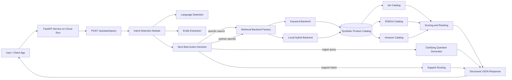
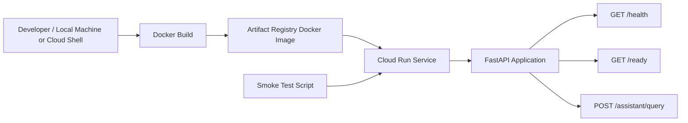
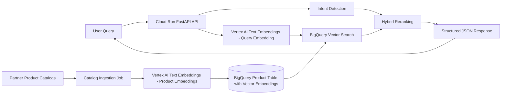

# Architecture

This document describes the current architecture of the `payback-lightweight-assistant` backend service.

The application is a lightweight FastAPI microservice that receives a raw user query and returns a structured response containing either recommended products or a clarifying question.

## High-Level Goal

The assistant is designed to support a PAYBACK-like product discovery experience across three different partner ecosystems:

| Partner  | Example Ecosystem   | Product Type                                                |
| -------- | ------------------- | ----------------------------------------------------------- |
| `dm`     | Drugstore           | High-frequency, low-price drugstore and personal care items |
| `edeka`  | Grocery             | Food, fresh produce, and grocery items                      |
| `amazon` | General marketplace | Long-tail general merchandise                               |

The service supports multiple query types, including:

* direct product search,
* discovery-style shopping requests,
* comparison requests,
* partner-specific navigational searches,
* customer support routing,
* vague queries requiring clarification.

## Current MVP Architecture



The current implementation is local-first and deterministic. The hybrid retriever is a local prototype only; it does not depend on Vertex AI, BigQuery, or any hosted model service.

## Current Runtime Deployment Architecture



This reflects the current Docker and Cloud Run deployment path. The checked-in service still uses the synthetic catalog packaged with the application.

## Main Components

### 1. FastAPI API Layer

The API layer exposes HTTP endpoints used by clients and deployment checks.

Main endpoints:

| Endpoint            | Method | Purpose                             |
| ------------------- | -----: | ----------------------------------- |
| `/health`           |    GET | Basic service health check          |
| `/ready`            |    GET | Readiness check                     |
| `/assistant/query`  |   POST | Main assistant query endpoint       |
| `/catalog/products` |    GET | Product catalog inspection endpoint |

The main endpoint accepts a user query and returns a structured response with language, intent, specificity, next best action, extracted entities, and recommendation results.

### 2. Intent Detection Module

The intent detection module analyzes the raw user query and detects:

* language,
* intent,
* specificity,
* partner hint,
* product category,
* price preference,
* occasion,
* brand or other basic entities.

Supported intent types include:

| Intent             | Meaning                                                    |
| ------------------ | ---------------------------------------------------------- |
| `search`           | User is looking for a specific product or product category |
| `discovery`        | User describes a broader need or shopping occasion         |
| `comparison`       | User wants to compare options                              |
| `customer_support` | User needs support rather than product search              |
| `unknown`          | Intent cannot be confidently identified                    |

### 3. Next Best Action Decision

Based on intent and specificity, the system decides what to do next.

Possible next best actions:

| Next Best Action          | Behavior                                             |
| ------------------------- | ---------------------------------------------------- |
| `search_catalog`          | Search across partner catalogs                       |
| `partner_specific_search` | Search within a specific partner ecosystem           |
| `compare_products`        | Return catalog results with comparison summary fields |
| `ask_clarifying_question` | Return a clarifying question instead of weak results |
| `route_to_support`        | Route the user to customer support flow              |

### 4. Synthetic Product Catalog

The MVP uses a synthetic in-repository catalog representing three partner ecosystems:

* `dm`,
* `edeka`,
* `amazon`.

Each product contains structured fields such as:

* product ID,
* partner,
* name,
* category,
* description,
* tags,
* price,
* currency,
* promotion flag,
* popularity score.

This allows the retrieval engine to simulate cross-partner product discovery without relying on external APIs.

### 5. Retrieval Engine

The retrieval engine is deterministic and lightweight by default.

Stage 7A introduced a retrieval backend abstraction so the assistant can choose a retriever through configuration without changing the API schema.

Available backends:

| Backend | Default | Purpose |
| ------- | ------- | ------- |
| `keyword` | yes | Existing deterministic keyword retrieval with business boosts. |
| `hybrid` | no | Local prototype combining keyword score, deterministic local semantic-like similarity, and existing business boosts. |

The `keyword` backend uses:

* query term matching,
* product name matching,
* category matching,
* tag matching,
* description matching,
* partner hints,
* category hints,
* price preference boosts,
* promotion boosts,
* popularity boosts.

The `hybrid` backend additionally builds deterministic product text, embeds queries and products with a local hash-based embedding provider, computes cosine similarity, and combines that semantic-like score with the keyword and business-rule signals.

The local embedding provider does not call external APIs, does not download ML models, and is intended for tests and local experiments. It is not a production vector search implementation.

The default retrieval approach remains intentionally simple, explainable, and cost-efficient.

### 6. Response Builder

The assistant returns a structured JSON response containing:

* original query,
* detected language,
* detected intent,
* specificity,
* next best action,
* clarifying question if needed,
* partner hint,
* extracted entities,
* ranked product recommendations,
* optional comparison summary and criteria for comparison intent.

Example response shape:

```json
{
  "query": "Bitte zeige mir Angebote für günstige Windeln",
  "language": "de",
  "intent": "search",
  "specificity": "specific",
  "next_best_action": "search_catalog",
  "clarifying_question": null,
  "partner_hint": "dm",
  "entities": {
    "product_category": "baby care",
    "price_preference": "cheap",
    "occasion": null,
    "dietary_preference": null,
    "brand": null
  },
  "results": [],
  "comparison_summary": null,
  "comparison_criteria": []
}
```

## Cloud Deployment

The current deployment uses the following Google Cloud services:

| Service           | Role                                                    |
| ----------------- | ------------------------------------------------------- |
| Artifact Registry | Stores the Docker image                                 |
| Cloud Run         | Runs the FastAPI container as a serverless HTTP service |
| Cloud Logging     | Stores runtime logs from Cloud Run                      |

The build step is performed locally with Docker before pushing the image to Artifact Registry.

After deployment, the service is available as a public HTTPS endpoint on Cloud Run.

This is deployment plumbing, not the future production retrieval architecture. It keeps the current MVP portable while allowing a later swap to managed GCP services.

## Current MVP Design Decisions

### Deterministic Intent Detection

The current version uses deterministic intent detection instead of an LLM-based intent classifier.

Reason:

* lower latency,
* no inference cost,
* predictable behavior,
* easier debugging,
* no dependency on external model availability.

### In-Memory Catalog Retrieval

The current version uses in-memory retrieval over a small synthetic dataset.

Reason:

* small catalog size,
* faster MVP implementation,
* no database dependency,
* simple local and cloud deployment,
* easy testability.

### Pluggable Retrieval Backends

Stage 7A introduced retrieval backends to separate assistant orchestration from retrieval implementation details.

Reason:

* preserve the existing keyword behavior as the default,
* allow local hybrid retrieval experiments,
* keep the API response schema stable,
* prepare for future production retrieval backends without forcing new infrastructure into the MVP.

The Cloud Run deployment can remain unchanged because `RETRIEVAL_BACKEND` defaults to `keyword`.

### Cloud Run Instead of GKE

Cloud Run was selected for deployment instead of GKE or virtual machines.

Reason:

* serverless container runtime,
* simple deployment model,
* scales to zero,
* lower operational overhead,
* suitable for lightweight APIs and demos.

## Future GCP Production Architecture

Future production work can extend the MVP with Vertex AI and BigQuery Vector Search.

Stage 7B does not implement this production architecture. The current `hybrid` backend is local-only and uses deterministic hash embeddings.



## Possible Production Improvements

### Vertex AI Text Embeddings

Vertex AI could be used to generate embeddings for:

* user queries,
* product names,
* product descriptions,
* product tags,
* product categories.

This would allow the assistant to retrieve semantically related products even when exact keywords do not match.

Example:

```text
I need stuff for a pasta dinner
```

could retrieve:

* pasta,
* tomato sauce,
* basil,
* parmesan,
* olive oil,

even if not all terms appear directly in the query.

### BigQuery Vector Search

BigQuery Vector Search could be used to store and search product embeddings at larger scale.

A possible BigQuery table structure:

| Column        | Type           | Description               |
| ------------- | -------------- | ------------------------- |
| `product_id`  | STRING         | Unique product identifier |
| `partner`     | STRING         | Partner ecosystem         |
| `name`        | STRING         | Product name              |
| `category`    | STRING         | Product category          |
| `description` | STRING         | Product description       |
| `tags`        | ARRAY<STRING>  | Product tags              |
| `price`       | FLOAT          | Product price             |
| `currency`    | STRING         | Currency                  |
| `embedding`   | ARRAY<FLOAT64> | Product embedding vector  |

### Hybrid Retrieval

The local Stage 7A hybrid retriever combines:

* deterministic keyword matching,
* local semantic-like similarity,
* partner hints,
* category hints,
* price preferences,
* promotions,
* popularity,
* business rules.

A production retrieval engine could use the same high-level shape but replace local hash embeddings and in-memory search with managed vector infrastructure.

It should combine:

* semantic vector similarity,
* keyword matching,
* partner hints,
* category hints,
* price preferences,
* promotions,
* popularity,
* business rules.

This would preserve explainability while improving semantic recall.

## Current Limitations

The current MVP does not include:

* real partner APIs,
* real-time inventory,
* user history,
* personalization,
* Vertex AI embeddings,
* BigQuery product storage,
* BigQuery Vector Search,
* LLM-based intent classification,
* authentication,
* rate limiting,
* advanced observability dashboards.

These limitations are intentional for the lightweight MVP scope.

## Summary

The current architecture provides a complete lightweight assistant backend with:

* FastAPI API,
* deterministic intent detection,
* synthetic multi-partner catalog,
* cross-partner retrieval,
* structured JSON responses,
* Docker containerization,
* local Docker build and Artifact Registry push,
* Artifact Registry image storage,
* Cloud Run deployment,
* local and deployed smoke test support.

The architecture is intentionally simple, explainable, and cost-efficient, while leaving a clear path toward a production-grade GCP-native implementation using Vertex AI and BigQuery Vector Search.
